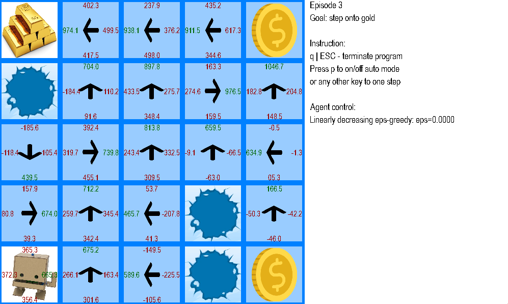

# FrozenLake RL Project
<div align="center">
    
</div>

### Description

This project implements the "Frozen Lake" environment along with a Q-learning agent. The goal is to explore reinforcement learning methods using algorithms such as Q-learning and manual agent control. The project includes the environment, the agent, and a graphical interface for visualization and manual control.

### Features

- **Frozen Lake Environment**: Simulates a frozen lake with traps and rewards.
- **Q-learning Agent**: Learns optimal policies through exploration and exploitation.
- **Manual Control**: Allows manual control of the agent in the environment using the keyboard.
- **Graphical Interface**: Visualizes the environment and the agent using the Pygame library.
- **Model Saving and Loading**: Allows saving and loading the agent's state.

### Instructions

1. **Installation**:
    - Ensure you have the Pygame and numpy libraries installed. You can install them using the following commands:
      ```sh
      pip install pygame numpy
      ```
2. **Configuration Parameters**:
    - In the `main.py` file, you can adjust the following parameters:
      - `agent`: Choose between 'q_learning' and 'manual'.
      - `render`: Set to `True` or `False` depending on whether you want to visualize the environment.
      - `mode`: Choose between 'train' and 'test' depending on the agent's operation mode.

### Sample Code

```python
import os
from envs.frozen_lake import FrozenLake
from gui.main_pygame import main_pygame
from gui.manual_pygame_agent import ManualPygameAgent
from q_agent import QAgent

from glob import glob
import datetime

if __name__ == '__main__':
    agent = 'q_learning'            # 'q_learning' or 'manual'
    render = False
    mode = 'test'                  # 'train' or 'test'

    env = FrozenLake()

    if agent == 'manual':
        agent = ManualPygameAgent()
        if not render or mode != 'train':
            render = True
            mode = 'train'
            print("WARNING: For manual agent control forcing: render=True, mode='train'.")
    elif agent == 'q_learning':
        agent = QAgent(n_states=env.n_states, n_actions=env.n_actions)
    else:
        raise ValueError("Not supported agent: should be either 'q_learning' or 'manual'")

    date = 'run-{date:%Y-%m-%d_%H:%M:%S}'.format(date=datetime.datetime.now()).replace(':', '-')
    save_path_dir = '/'.join(['saved_models', env.name, agent.name, date])
    save_path = save_path_dir + '/model'

    def get_prev_run_model(base_dir):
        dirs = glob(os.path.dirname(base_dir) + '/*')
        dirs.sort(reverse=True)
        if len(dirs) == 0:
            raise AssertionError("Run code in 'train' mode first.")
        return dirs[0] + '/model.npy'

    if mode == 'test':
        state_path = get_prev_run_model(save_path_dir)
        print(f"Testing model from latest run.")
        print(f"\tLoading agent state from {state_path}")
        agent.load(state_path)
        if hasattr(agent, "epsilon"):
            agent.epsilon = 0.0
            agent.eps_min = 0.0

    print(f"Env name: {env.__class__.__name__}")
    print(f"Mode: {mode}")

    main_pygame(env, agent, save_path=save_path, render=render,
                num_episodes=5000, test_mode=(mode == 'test'))

